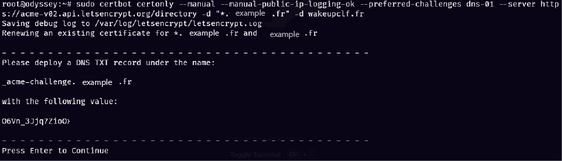

# Génération d'un certificat SSL avec Certbot

Ce document décrit comment générer un certificat SSL pour votre domaine en utilisant Certbot.

## Installation de Certbot

1. Ouvrez un terminal.

2. Exécutez la commande suivante pour installer Certbot et le plugin Nginx :

```bash
sudo apt update
sudo apt install certbot python3-certbot-nginx
```

## Génération du certificat SSL
 1. Exécutez la commande suivante pour générer le certificat SSL :

 ```bash
 sudo certbot certonly --manual --manual-public-ip-logging-ok --preferred-challenges dns-01 --server https://acme-v02.api.letsencrypt.org/directory -d "*.example.fr" -d example.fr
 ```

 Remplacez example.fr par votre nom de domaine.

2. Suivez les instructions à l'écran pour vérifier la propriété du domaine.

 il faudra en parallèle se connecter  à votre platerforme (Ionos, Hostinger,...) où vous avez acheté votre nom de domaine afin d'insérer deux lignes TXT dans vos paramètres DNS que le prompt de la commande vous indiquera de saisir comme ci-dessous, 

 

example :

 

Une fois la vérification terminée, Certbot générera le certificat SSL et vous indiquera l'emplacement du certificat sur votre système.

## Configuration du serveur Nginx

Après avoir généré le certificat SSL, vous devrez le configurer dans Nginx.

1. Ouvrez le fichier de configuration de votre site Nginx et ajoutez les directives SSL.

2. Testez la configuration de Nginx pour vous assurer qu'il n'y a pas d'erreurs :

```bash
sudo nginx -t
```

3. Si la configuration est correcte, redémarrez Nginx pour appliquer les modifications :

```bash
sudo systemctl restart nginx
```

## Renouvellement du certificat

Les certificats Let's Encrypt sont valides pendant 90 jours. Pour les certificats générés avec l'option --manual, le renouvellement automatique n'est pas possible car il nécessite une intervention manuelle pour la vérification du domaine. Vous devrez donc répéter le processus de génération du certificat pour renouveler votre certificat SSL.